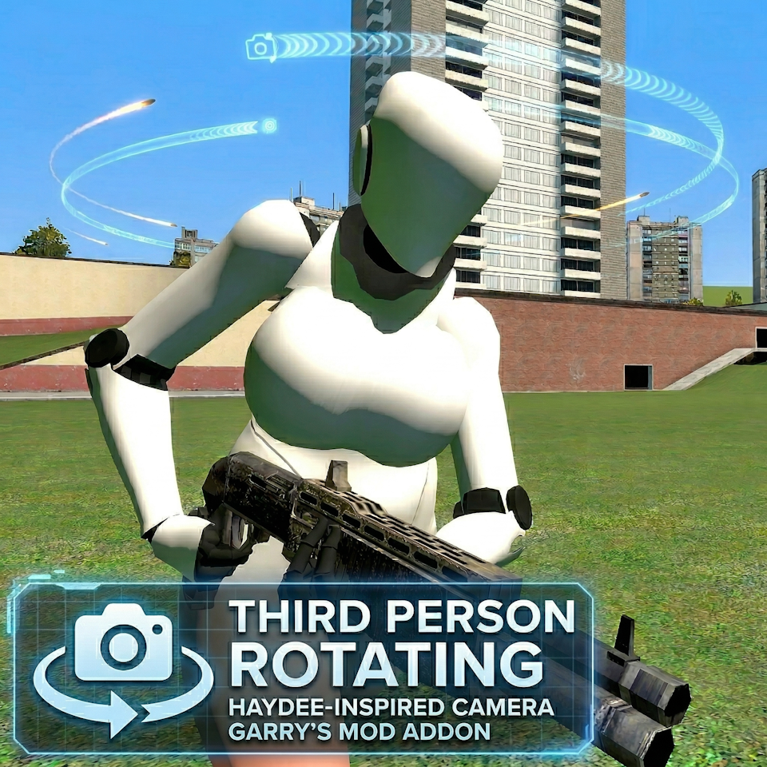

<div align="center">
  
  <h1>Third Person Rotating Camera</h1>
  <p><b>A highly customizable over-the-shoulder camera for Garry's Mod, inspired by Haydee.</b></p>
  
  [](https://steamcommunity.com/sharedfiles/filedetails/?id=1620191091)
  [](https://github.com/thegamerbay/gmod-rotating-third-person/actions/workflows/test.yml)
  [](https://github.com/thegamerbay/gmod-rotating-third-person/actions/workflows/lint.yml)
  [](https://codecov.io/gh/thegamerbay/gmod-rotating-third-person)
  [](https://opensource.org/licenses/MIT)
</div>

<br/>

## 📖 Overview

The **Third Person Rotating Camera** is a professional Garry's Mod addon that completely overhauls the game's default third-person perspective. Designed identically after the camera mechanics from the game *Haydee*, this mod aims to deliver a precise, responsive, and highly customizable over-the-shoulder camera system.

Whether you're engaging in sandbox play or exploring maps, this addon offers unparalleled control over your viewing angles to maximize your gameplay experience.

---

## ✨ Features

* **True Aim-to-Look Mechanics:** Your player model dynamically adjusts and looks exactly where you are aiming.
* **Precise Multiplayer Prediction:** No more rubberbanding or "auto-walking"! The movement is perfectly synced and calculated relative to the camera's angle.
* **Smart Scope Integration:** Play alongside weapon bases like TFA or CW 2.0 without conflict. The camera seamlessly auto-transitions to first-person when aiming through high-power sniper scopes.
* **Classic Movement Mode:** Prefer standard Garry's Mod controls? Enable the Classic mode setting to lock your player model to the camera direction while retaining the over-the-shoulder view.
* **Toggle Aim:** Prefer not to hold the aim button? Enable Toggle Aim in the settings for single-click aiming.
* **Invert Y-Axis Support:** Built-in axis inversion for players who prefer traditional flight-stick style pitch control.
* **Shoulder Switching:** Quickly swap your camera from the right shoulder to the left shoulder with a single command.
* **Dynamic Crosshair Tracing:** Enable the true trajectory crosshair to see exactly where your bullets will land in 3D space.
* **Extensive Customization:** Manage your camera's X, Y, and Z offsets, FOV, and speeds seamlessly via the Garry's Mod Context Menu.

---

## 🎮 How to Use

### In-Game Menu
Customize the camera in real-time without typing any commands!
1. Hold **`C`** to open the Garry's Mod Context Menu.
2. Click on the **Third Person Rotating Camera** icon (usually located on the top bar or under a dedicated tab).
3. Adjust the sliders for Camera Distance, Up/Down, Right/Left, and FOV.
4. Set your preferred Aiming button (default is Right Mouse Button).
5. Enable or disable new features like Toggle Aim, Smart Scope, and Invert Y-Axis directly via checkboxes.

### Quick Keybinds
You can bind useful functions directly in the developer console (`~`):

```bash
# Toggle the third-person camera ON and OFF with a single key (e.g., 'X')
bind x "rtp_toggle"

# Quickly swap shoulders (moves camera from right to left, or vice versa)
bind v "rtp_switch_shoulder"
```

---

## ⚙️ ConVar Configuration

For server owners or power users, all variables can be configured via the console. 

| ConVar | Description | Default |
| :--- | :--- | :---: |
| `rtp_enabled` | Toggles the addon on (1) or off (0). | `1` |
| `rtp_camera_forward` | Controls the camera's distance from the player. | `50` |
| `rtp_camera_right` | Controls the camera's horizontal offset from the player. | `20` |
| `rtp_camera_up` | Controls the camera's vertical offset from the player. | `-10` |
| `rtp_camera_fov` | Sets the target Field of View for the camera. | `75` |
| `rtp_camera_zoom_fov` | How much FOV to subtract when aiming. | `15` |
| `rtp_player_rotation_speed`| Controls how fast the player model turns to match movement. | `5` |
| `rtp_player_aiming_button` | Mouse/Keyboard keycode for the aim button. | `108` |
| `rtp_toggle_aim` | If 1, clicking the aim button toggles the aiming state. | `0` |
| `rtp_smart_scope` | Automatically disables third-person when zooming in (FOV < 50). | `1` |
| `rtp_invert_y` | Inverts the vertical mouse pitch rotation. | `0` |
| `rtp_crosshair_hidden_if_not_aiming` | Hides the default crosshair while not aiming. | `0` |
| `rtp_classic_movement_mode` | Enables Classic movement mode: locks model rotation to camera direction. | `0` |
| `rtp_crosshair_trace_position` | Draws a custom dynamic crosshair showing true bullet trajectory. | `0` |

---

## 🧪 Developer Testing (Busted)

To ensure high-quality script stability without launching the game, this project has been fully instrumented with the **Busted** Lua testing framework. Garry's Mod APIs are safely mocked in `spec/helpers/gmod_mocks.lua`.

**Prerequisites:**
You will need [Lua](https://www.lua.org/) and [LuaRocks](https://luarocks.org/) installed on your machine.
```bash
# Install busted via luarocks
luarocks install busted
```

**Running Tests:**
Navigate to the addon's root directory and run:
```bash
busted
```

---

## 🛠️ Credits & Feedback

* **Inspiration:** Camera mechanics from *Haydee*.
* **Feedback:** If you find any issues, bugs, or have feature requests, please leave a comment on the [Steam Workshop Page](https://steamcommunity.com/sharedfiles/filedetails/?id=1620191091).

---

## 📄 License

This project is licensed under the [MIT License](LICENSE) - see the LICENSE file for details.
