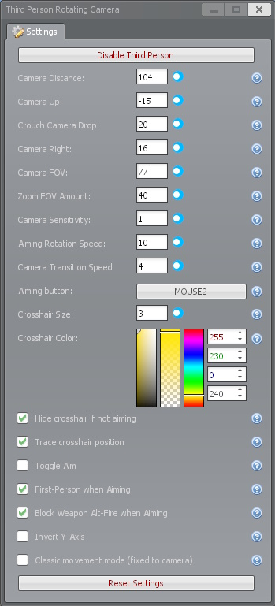

> 🌐 **Languages:** [English](README.md) | [Русский](README.ru.md) | [ไทย](README.th.md) | [简体中文](README.zh-CN.md)

<div align="center">
  
  <h1>第三人称旋转摄像机</h1>
  <p><b>一款高度可定制的 Garry's Mod 越肩视角摄像机插件，灵感来源于游戏《Haydee》。</b></p>
  
  [](https://steamcommunity.com/sharedfiles/filedetails/?id=1620191091)
  <br/>
  [](https://steamcommunity.com/sharedfiles/filedetails/?id=1620191091)
  [](https://steamcommunity.com/sharedfiles/filedetails/?id=1620191091)
  [](https://steamcommunity.com/sharedfiles/filedetails/?id=1620191091)
  <br/>
  [](https://github.com/thegamerbay/gmod-rotating-third-person/actions/workflows/test.yml)
  [](https://github.com/thegamerbay/gmod-rotating-third-person/actions/workflows/lint.yml)
  [](https://codecov.io/gh/thegamerbay/gmod-rotating-third-person)
  [](https://opensource.org/licenses/MIT)
</div>

<br/>

## 📖 概述

**第三人称旋转摄像机 (Third Person Rotating Camera)** 是一款彻底改变游戏默认第三人称视角的 Garry's Mod 插件。本模组的摄像机机制设计与游戏《Haydee》完全一致，旨在提供一个精准、响应迅速且高度可定制的越肩摄像机系统。

无论你是在沙盒模式中游玩还是在探索地图，此插件都能为你提供无与伦比的视角控制，将你的游戏体验最大化。

---

## ✨ 特性

* **真实的瞄准观察机制：** 你的玩家模型会动态调整，且准确地看向你正在瞄准的地方。
* **瞄准旋转平滑度：** 精确配置你在进行武器瞄准时主角身体转向摄像机的平滑和延迟程度。
* **精准的多人游戏预测：** 告别橡皮筋式卡顿或“自动行走”！移动完美同步，并相对于摄像机角度进行计算。
* **混合模式 (Smart Scope)：** 与 TFA 或 CW 2.0 等武器库一起游玩而不会产生冲突。尝试瞄准时，摄像机会无缝自动切换到第一人称视角。
* **经典移动模式：** 更喜欢标准的 Garry's Mod 控制方式？开启经典模式设置，可将你的玩家模型方向锁定为摄像机方向，同时保留越肩视角。
* **切换瞄准：** 不想一直按住瞄准键？在设置中开启“切换瞄准”即可实现单击切换瞄准状态。
* **Y轴反转支持：** 内置反转轴选项，专为喜欢传统飞行摇杆式俯仰控制的玩家设计。
* **摄像机灵敏度：** 通过专属的乘数设置来调节越肩视角的转动速度，以此补偿第三人称的视差效应。
* **切换肩视角：** 只需一条指令，即可将摄像机从右肩快速切换到左肩。
* **动态准星追踪：** 开启真实轨迹准星，可以在3D空间中准确看到你的子弹落点。支持使用 RGBA 颜色和大小设置进行完全自定义！
* **下蹲摄像机下降量：** 在下蹲时保持完全控制！自定义调整摄影机的下降高度，以在狭窄空间内保持无阻的视野。
* **丰富的自定义选项：** 通过 Garry's Mod 上下文菜单（C键菜单）无缝管理你的摄像机的 X、Y、Z 轴偏移量、视野（FOV）和速度。
* **全面的本地化支持（31种语言）：** 为每个设置项提供高质量的原生 UI 翻译和上下文帮助提示。

---

## 🎮 如何使用

### 游戏内菜单
无需输入任何指令，实时自定义摄像机！
1. 按住 **`C`** 键打开 Garry's Mod 上下文菜单。
2. 点击 **Third Person Rotating Camera（第三人称旋转摄像机）** 图标（通常位于顶部栏或专属标签页下）。
3. 调整摄像机距离、上下、左右以及 FOV（视野）滑块。
4. 设置你偏好的瞄准按键（默认为鼠标右键）。
5. 直接通过复选框启用或禁用诸如切换瞄准、混合模式 (Smart Scope) 和 Y轴反转等新特性。



### 快速快捷键
你可以直接在开发者控制台（`~`）中绑定实用功能：

```bash
# 用单个按键开启或关闭第三人称摄像机（例如“X”键）
bind x "rtp_toggle"

# 快速切换肩视角（将摄像机从右侧移至左侧，反之亦然）
bind v "rtp_switch_shoulder"
```

---

## ⚙️ ConVar 变量配置

针对服务器服主或高级用户，可以通过控制台配置所有变量。

| ConVar | 描述 | 默认值 |
| :--- | :--- | :---: |
| `rtp_enabled` | 开启 (1) 或关闭 (0) 插件。 | `1` |
| `rtp_camera_forward` | 控制摄像机与玩家的距离。 | `50` |
| `rtp_camera_right` | 控制摄像机相对于玩家的水平偏移。 | `20` |
| `rtp_camera_up` | 控制摄像机相对于玩家的垂直偏移。 | `-10` |
| `rtp_camera_crouch_drop` | 玩家下蹲时摄像机下降的距离。（0 = 不下降） | `20` |
| `rtp_camera_fov` | 设置摄像机的目标视野 (FOV)。 | `75` |
| `rtp_camera_zoom_fov` | 瞄准时要减去的 FOV 数值。 | `15` |
| `rtp_camera_sens_multiplier` | 摄像机旋转速度乘数（1.0 = 正常，0.5 = 半速）。 | `1.0` |
| `rtp_player_rotation_speed`| 控制玩家模型转向以匹配移动的速度。 | `5` |
| `rtp_aim_rotation_speed` | 瞄准时角色旋转的平滑度（1 = 缓慢，20 = 灵敏）。 | `10` |
| `rtp_player_aiming_button` | 瞄准按键的鼠标/键盘键码。 | `108` |
| `rtp_toggle_aim` | 若为 1，点击瞄准键将切换瞄准状态。 | `0` |
| `rtp_smart_scope` | 瞄准时自动切换到第一人称视角（混合模式）。 | `0` |
| `rtp_invert_y` | 反转鼠标垂直俯仰旋转。 | `0` |
| `rtp_crosshair_hidden_if_not_aiming` | 非瞄准状态下隐藏默认准星。 | `0` |
| `rtp_classic_movement_mode` | 启用经典移动模式：将模型旋转锁定为摄像机方向。 | `0` |
| `rtp_crosshair_trace_position` | 绘制显示真实子弹轨迹的自定义动态准星。 | `0` |
| `rtp_crosshair_size` | 调整自定义准星的大小。 | `3` |
| `rtp_crosshair_r`, `g`, `b`, `a` | 调整自定义准星的颜色 (RGBA)。 | `255, 230, 0, 240` |

---

## 🧪 开发者测试 (Busted)

为了在不启动游戏的情况下确保高质量脚本的稳定性，本项目全面引入了 **Busted** Lua 测试框架。Garry's Mod API 已经在 `spec/helpers/gmod_mocks.lua` 中被安全地模拟。

**前置条件：**
你需要在电脑上安装 [Lua](https://www.lua.org/) 和 [LuaRocks](https://luarocks.org/)。
```bash
# 通过 luarocks 安装 busted
luarocks install busted
```

**运行测试：**
导航至插件根目录并运行：
```bash
busted
```

---

## 🛠️ 致谢与反馈

* **灵感来源：** 游戏《Haydee》的摄像机机制。
* **反馈：** 如果你发现任何问题、漏洞或有功能需求，请在 [Steam 创意工坊页面](https://steamcommunity.com/sharedfiles/filedetails/?id=1620191091) 留言。

---

## 📄 许可证

本项目采用 [MIT 许可证](LICENSE) - 详情请参阅 LICENSE 文件。